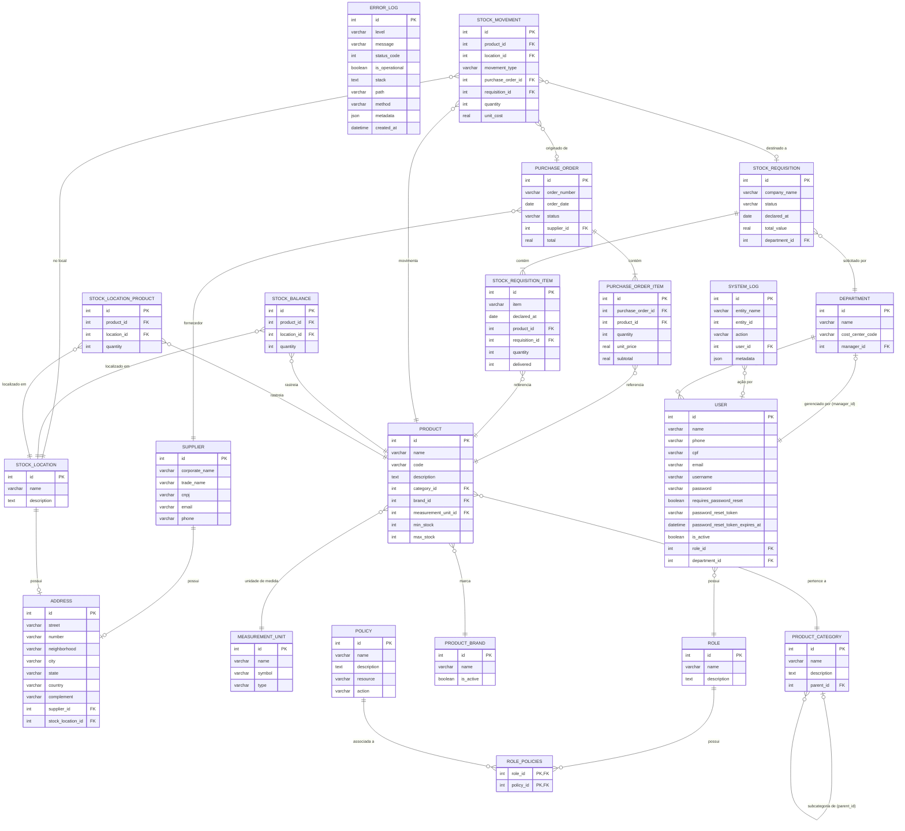

```mermaid
erDiagram
    ADDRESS {
        int id PK
        varchar street
        varchar number
        varchar neighborhood
        varchar city
        varchar state
        varchar country
        varchar complement
        int supplier_id FK
        int stock_location_id FK
    }

    DEPARTMENT {
        int id PK
        varchar name
        varchar cost_center_code
        int manager_id FK
    }

    ERROR_LOG {
        int id PK
        varchar level
        varchar message
        int status_code
        boolean is_operational
        text stack
        varchar path
        varchar method
        json metadata
        datetime created_at
    }

    MEASUREMENT_UNIT {
        int id PK
        varchar name
        varchar symbol
        varchar type
    }

    POLICY {
        int id PK
        varchar name
        text description
        varchar resource
        varchar action
    }

    PRODUCT_BRAND {
        int id PK
        varchar name
        boolean is_active
    }

    PRODUCT_CATEGORY {
        int id PK
        varchar name
        text description
        int parent_id FK
    }

    PRODUCT {
        int id PK
        varchar name
        varchar code
        text description
        int category_id FK
        int brand_id FK
        int measurement_unit_id FK
        int min_stock
        int max_stock
    }

    PURCHASE_ORDER {
        int id PK
        varchar order_number
        date order_date
        varchar status
        int supplier_id FK
        real total
    }

    PURCHASE_ORDER_ITEM {
        int id PK
        int purchase_order_id FK
        int product_id FK
        int quantity
        real unit_price
        real subtotal
    }

    ROLE {
        int id PK
        varchar name
        text description
    }

    ROLE_POLICIES {
        int role_id PK, FK
        int policy_id PK, FK
    }

    STOCK_BALANCE {
        int id PK
        int product_id FK
        int location_id FK
        int quantity
    }

    STOCK_LOCATION_PRODUCT {
        int id PK
        int product_id FK
        int location_id FK
        int quantity
    }

    STOCK_LOCATION {
        int id PK
        varchar name
        text description
    }

    STOCK_MOVEMENT {
        int id PK
        int product_id FK
        int location_id FK
        varchar movement_type
        int purchase_order_id FK
        int requisition_id FK
        int quantity
        real unit_cost
    }

    STOCK_REQUISITION {
        int id PK
        varchar company_name
        varchar status
        date declared_at
        real total_value
        int department_id FK
    }

    STOCK_REQUISITION_ITEM {
        int id PK
        varchar item
        date declared_at
        int product_id FK
        int requisition_id FK
        int quantity
        int delivered
    }

    SUPPLIER {
        int id PK
        varchar corporate_name
        varchar trade_name
        varchar cnpj
        varchar email
        varchar phone
    }

    SYSTEM_LOG {
        int id PK
        varchar entity_name
        int entity_id
        varchar action
        int user_id FK
        json metadata
    }

    USER {
        int id PK
        varchar name
        varchar phone
        varchar cpf
        varchar email
        varchar username
        varchar password
        boolean requires_password_reset
        varchar password_reset_token
        datetime password_reset_token_expires_at
        boolean is_active
        int role_id FK
        int department_id FK
    }

    %% Relacionamentos
    SUPPLIER ||--o| ADDRESS : "possui"
    STOCK_LOCATION ||--o| ADDRESS : "possui"
    
    DEPARTMENT |o--|| USER : "gerenciado por (manager_id)"
    USER }o--|| DEPARTMENT : "pertence a (department_id)"
    USER }o--|| ROLE : "possui"
    
    ROLE ||--o{ ROLE_POLICIES : "possui"
    POLICY ||--o{ ROLE_POLICIES : "associada a"
    
    PRODUCT_CATEGORY |o--o{ PRODUCT_CATEGORY : "subcategoria de (parent_id)"
    PRODUCT }o--|| PRODUCT_CATEGORY : "pertence a"
    PRODUCT }o--|| PRODUCT_BRAND : "marca"
    PRODUCT }o--|| MEASUREMENT_UNIT : "unidade de medida"
    
    PURCHASE_ORDER }o--|| SUPPLIER : "fornecedor"
    PURCHASE_ORDER ||--|{ PURCHASE_ORDER_ITEM : "contém"
    PURCHASE_ORDER_ITEM }o--|| PRODUCT : "referencia"
    
    STOCK_REQUISITION }o--|| DEPARTMENT : "solicitado por"
    STOCK_REQUISITION ||--|{ STOCK_REQUISITION_ITEM : "contém"
    STOCK_REQUISITION_ITEM }o--|| PRODUCT : "referencia"
    
    STOCK_MOVEMENT }o--|| PRODUCT : "movimenta"
    STOCK_MOVEMENT }o--|| STOCK_LOCATION : "no local"
    STOCK_MOVEMENT }o--o| PURCHASE_ORDER : "originado de"
    STOCK_MOVEMENT }o--o| STOCK_REQUISITION : "destinado a"
    
    STOCK_BALANCE }o--|| PRODUCT : "rastreia"
    STOCK_BALANCE }o--|| STOCK_LOCATION : "localizado em"
    
    STOCK_LOCATION_PRODUCT }o--|| PRODUCT : "rastreia"
    STOCK_LOCATION_PRODUCT }o--|| STOCK_LOCATION : "localizado em"
    
    SYSTEM_LOG }o--o| USER : "ação por"
```
